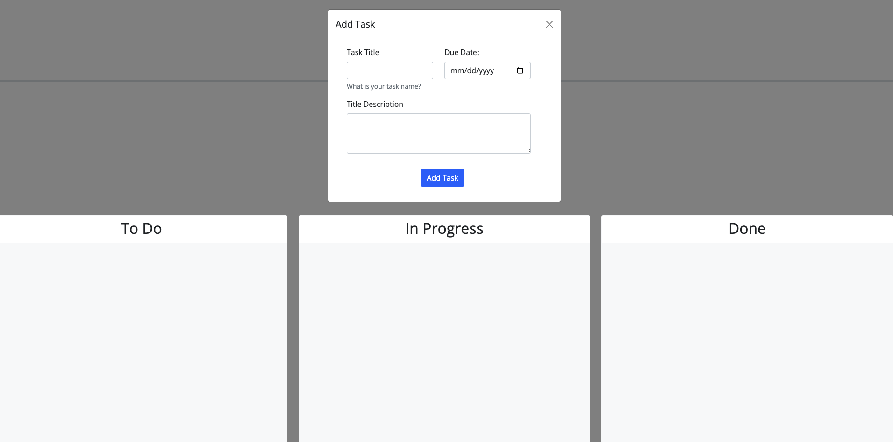

# Task Board
 
## Motivation

The motivation to create this task board application is to prioritize tasks and create organziation with a task list and associated due dates. 

## What does it solve and provide?
This application will help organzie and display a list of tasks that need to be complete by a specific date. Many tasks and assignments can be overwhelming and having a simple way to track and organize these responsibilties will help reduce stress and amke for a more efficent process. 

## Features
This webisite allows a users the ability to create a to-do list that has a title, due date, and description. Each task will have the ability to move from three categories from To Do, In Progress, and Done. 

 ## Installation 
 Clone the respository to your Github account and deploy the website once finished and approved code. 
 
 Website Link: https://brandondell.github.io/Task-Board/
 GitHub: https://github.com/BrandonDell/Task-Board
 
 ## Image
 

 ## Credits
 -UCF Coding Bootcamp
 -Tutor Chris assisted debuging 

 ## License
 N/A
